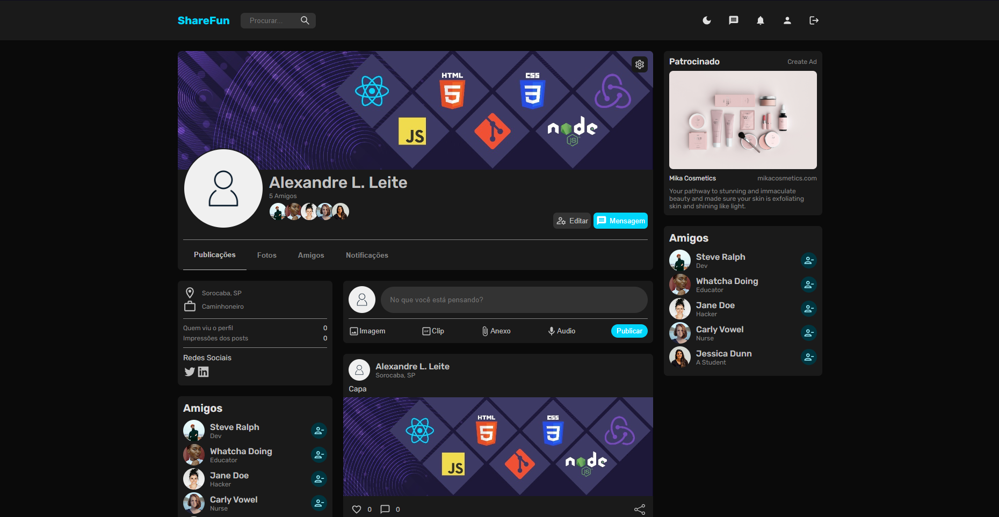

# Social Media (Front-end) (Work in Progress)

Back-end corresponding: https://github.com/GiovanniLeite/backendSocialMedia

## 📋 Presentation

The project consists of a Social Network inspired by Facebook and similar platforms. It includes standard features such as user profile creation and editing, a friend system, and messaging between users. Users can create posts containing text, images, and videos, with the option for interactions such as likes and comments. Additionally, the platform provides space for displaying ads and sponsored links.

## 🛠️ Front-end built with
- JavaScript
- React
- Redux
- HTML5
- CSS3
- Vite
- ESLint
- Prettier

## 🔧 Installation

- Install dependencies: `npm install`

- Configure environment variables: `cp .env.example .env`

- Start development application: `npm run dev`

## 📫 Contact

